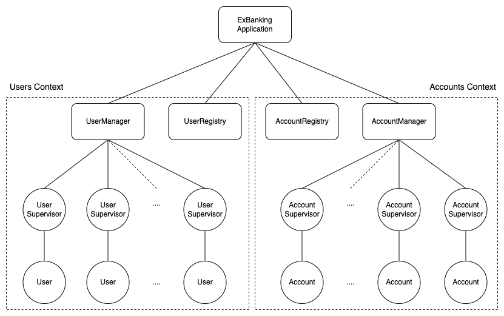

# ExBanking

`ex_banking` is an OTP application written in elixir that provides a set of public APIs to create, get, deposit, withdraw, and send money among users. 
To understand what features `ex_banking` has to offer, you could see the API specifications in [TASK.md](TASK.md).

## Application Tree

`ex_banking` consists out of two major components (or context): `Users` and `Accounts`. `Users`
manages user related data in the bank such as create a new user or check if a user exists
and `Accounts` manages currency related data that is modelled as an account.

Each user in the bank is represented as a genserver process hence a bank with 10 users will have
10 genserver processes. This is also the case for an account. The account process is used to store
an account balance and the user process is used to limit the number concurrent operations within a single user.

Since different users are presented by different process (or actor), two operations to different users
can be processed concurrently at the same time while multiple processes to a single user will be handled
one at a time. This way, the user process can be used as a synchronization point to provide back-pressure for users.

## Design Considerations

Some of the design consideration while building this app are as follows:

1. All amount of money (when returned to user) will always be rounded down to 2 decimal places. The down rounding is chosen so if a user has, e.g 100.125 EURO in his account and decided to withdraw all of his/her money, the user could only withdraw at max 100.12 EURO instead of 100.13 EURO. The extra 0.01 EURO might not mean much but if this up rounding happens to, e.g 1 million of users then the bank will lose `0.01 * 1,000,000 = 10,000 EURO` hence the down rounding is considered important in this app.
2. Syntactically the app is heavily built using an elixir `with` keyword. This is done to increase the readibility of every occuring computation and gives developers flexibility to add, remove, or modify steps in an operation.
3. Each `User` or `Account` process is spawned with a supervisor to increase the fault tolerance of the whole application. I.e if a `User` or `Account` process unknownly keep crashing in a loop, the error will be trapped by the supervisor, leaving the manager process safe and the whole app to keep running.
4. All user's currency accounts are represented with different processes instead of just one per user. This is so that a crash is one currency account will not impact the other currencies, making them more fault tolerance (e.g from some currencies that might be harder to process) and faster to recover or restart after crash (e.g only need to recover or reload one currency from db).

## Setup

To start using `ex_banking` app locally, you would need to have elixir installed in your local machine. Otherwise, you could install it 
by following the official [elixir installation guide](https://elixir-lang.org/install.html). In this app, elixir version `1.13.4` is used.

### Start Application

1. Clone the repo.
2. Install the required dependencies by running `mix deps.get`.
3. Start the application in iex by running `iex -S mix`.

### Run Unit Test

1. To run unit test, you could use `mix test` command.
2. If you want to run unit test with coverage check, you could use `mix test --cover` command. The coverage reports will be generated under `cover` directory
